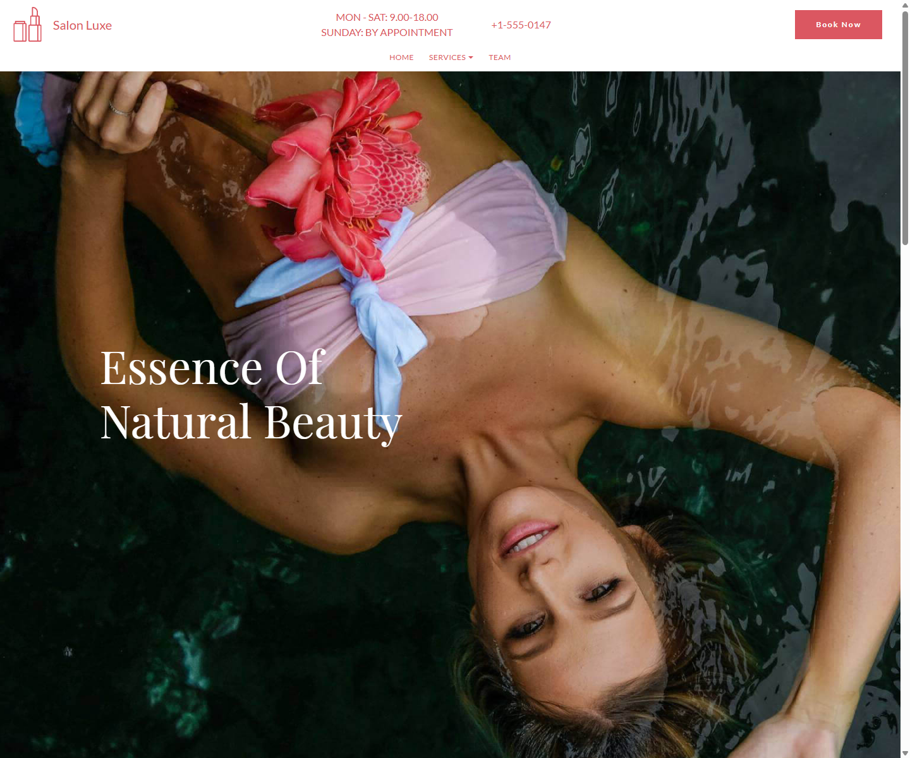
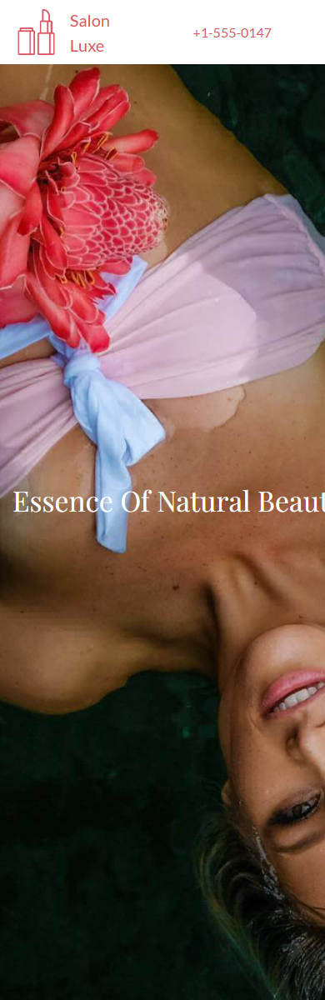

# Salon Luxe

Static AMP salon landing page for beauty services, stylists, pricing, testimonials, and appointment requests.

## Screenshots

### Desktop



### Mobile



## What Is Included

- Responsive AMP landing page in `index.html`
- Hero section with salon photography
- Services section
- Team section
- Pricing / booking callouts
- Testimonials
- Contact and appointment request form
- Local image assets under `assets/images`

## Fixes Applied

- Restored broken image paths by adding the referenced `assets/images` directory.
- Replaced template placeholder branding with `Salon Luxe`.
- Removed broken Mobirise outbound CTA links.
- Updated dummy contact details and metadata.
- Reworked the appointment form fields to use clean names: `name`, `email`, `phone`, and `service`.
- Replaced encoded template form payloads with readable form data.
- Added mobile hero text overrides to prevent clipped headings on smaller screens.
- Added README screenshots generated from the current page.

## Running Locally

This is a static site, so any local static server will work.

```bash
python -m http.server 3010
```

Then open:

```text
http://127.0.0.1:3010/
```

## Form Setup

The form currently posts to a placeholder FormSubmit endpoint:

```text
https://formsubmit.co/ajax/hello@salonluxe.example
```

Before publishing, replace `hello@salonluxe.example` with the salon's real booking email or connect the form to the production booking/CRM endpoint.

## Repository Structure

```text
.
├── index.html
├── assets/images/
├── docs/screenshots/
├── project.mobirise
└── hashes.json
```

## Deployment

The repo can be published on GitHub Pages, Netlify, Vercel, or any static host. No build step is required.
